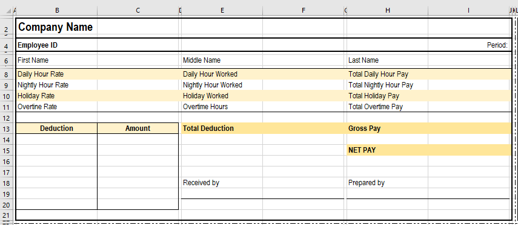

# Mugna
A simple program that automates the creation of payroll stub.

---

 <b>UNDER DEVELOPMENT

---

# Printing Stubs

### Sample Stub

### Stub Offsets 
[See the excel file here.](mugna/assets/sample_basis.xlsx)
### *X offset*

`x_offset = <nth employee> % 2 * <column per stub> + 1`

Scenario: Assuming that `column per stub` = 11, and we have 5 employees on the list.
### *Simulation*

| employee at index n| %2 | \*11 | +1 |
|:---:|:---:|:---:|:---:|
| 0 | 0 | 0 | 1 |
| 1 | 1 | 11 | 12 |
| 2 | 0 | 0 | 1 |
| 3 | 1 | 11 | 12 |
| 4 | 0 | 0 | 1 |

### *Why's?* 
#### \*11
	
1. Each stub has 11 columns.

#### +1
	
1. Stubs start at index 0 or 11.
2. The data to be printed is at column B and M.

#### %2
    
1. Stubs are printed in 2 columns.
2. Stub at 1st column starts at A, and stub at 2nd column starts at K.
> %2 indicates whether a stub should be printed at 1st column (A to K) or 2nd column (L to V).

### *Example* 
- The employee at index 0: 
	- [`0%2*11 = 0`] Stub starts at A.
	- [`0+1`] Data to be printed starts at B.
- The employee at index 1:
	- [`1%2*11 = 11`] Stub starts at L.
	- [`11+1`] Data to be printed starts at M.

### *Y offset*

---

 <b>Tomorrow :>

---